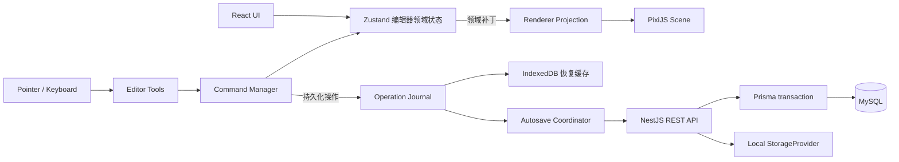

# 第一阶段架构设计

## 1. 目标与非目标

第一阶段的目标不是做一个功能齐全的 GIS，而是验证世界观地图编辑器最重要的闭环：用户能创建一张任意世界坐标尺寸的地图，在有限浏览器视口内编辑图章和图层，可靠撤销、自动保存、刷新恢复，并得到基础 PNG。

### 1.1 第一阶段完成定义

- 项目和地图可创建、重命名、打开与删除。
- 地图尺寸是世界单位，不决定 WebGL Canvas 尺寸。
- 相机支持指针中心缩放、平移、适应地图、定位选择。
- 图层可创建、重命名、排序、显隐、锁定、修改透明度、复制和删除。
- 可从素材面板放置原创山、树、城镇图章。
- 支持单选、框选、Shift 多选、移动、缩放、旋转、复制、删除和层级调整。
- 连续交互合并为一条 Command；撤销和重做之后的状态也会被保存。
- 自动保存有明确的 `saved / dirty / saving / offline / error / conflict` 状态。
- 刷新后从服务端恢复；异常关闭时可从 IndexedDB 恢复尚未确认的操作。
- 可导出受内存上限保护的基础 PNG。

### 1.2 明确延期

地形笔刷、区域、河流、道路、文字、地点资料、自定义上传、完整主题编辑和导航缩略图属于第二阶段。完整 Chunk 调度、空间索引、LOD、Worker、增量几何计算和分块导出属于第三阶段。队列、Redis、版本产品能力和发布地图属于第四阶段。协作和桌面封装属于第五阶段。

第一阶段会保留必要的数据字段和接口边界，但不会以“预留”为名实现上述功能。

## 2. 需求风险与应对

| 风险                               | 影响                               | 第一阶段决策                                                 |
| ---------------------------------- | ---------------------------------- | ------------------------------------------------------------ |
| 超大世界误解为超大画布             | 超过浏览器纹理/Canvas 上限并崩溃   | Canvas 永远等于编辑器视口；世界只是一套 `number` 坐标和边界  |
| MVP 单 JSON 保存形成迁移债务       | 对象增多后保存、冲突、版本都不可控 | 文档、图层、Chunk、对象从第一天分表；对象按 Chunk API 读写   |
| 把每次 pointermove 写入状态/数据库 | React 抖动、历史爆炸、MySQL 写放大 | 每帧合并交互；手势结束提交一个 Command；自动保存批量防抖     |
| React 与 Pixi 双向持有对象         | 状态漂移、资源泄漏、难测试         | 领域状态为真源；RendererProjection 单向把领域补丁投影到 Pixi |
| 撤销状态没有被自动保存             | 刷新后“撤销失效”                   | execute/undo/redo 均产生领域补丁，并进入同一保存日志         |
| 自动保存请求乱序                   | 旧响应覆盖新状态                   | 地图 `revision` + `clientMutationId` + 单地图串行保存队列    |
| 多标签页同时编辑                   | 隐性覆盖                           | 乐观并发；不匹配返回 409，UI 进入 conflict，禁止静默覆盖     |
| 图层锁只在 UI 生效                 | 构造请求仍可修改                   | 客户端交互层和服务端操作校验都检查锁定/所有权                |
| 全图导出分配巨型纹理               | GPU/内存失败                       | MVP 将全图等比缩放到安全输出上限；第三阶段才做分块原尺寸导出 |
| 素材版权不清晰                     | 产品与法律风险                     | MVP 仅使用仓库内原创 SVG/程序生成素材，并记录来源清单        |
| 删除图层造成对象孤儿               | 数据损坏                           | 删除操作必须显式选择级联删除或迁移对象；事务执行             |
| 浮点长期漂移                       | 变换不稳定                         | 状态保存世界变换；渲染时计算矩阵；提交时做有限精度归一化     |

## 3. 总体架构



数据流只有一个主要方向：领域状态改变后投影到渲染器。Pixi 事件不直接修改数据库模型，必须通过 Tool 和 Command。服务端返回的数据先通过共享 Zod schema，再进入 normalized store。

### 3.1 进程与包边界

- `apps/web`：React 壳、编辑工具、相机输入、Pixi 渲染适配、自动保存、导出 UI。
- `apps/api`：认证、所有权、项目/地图 CRUD、操作事务、资源元数据和本地存储抽象。
- `packages/map-model`：无 React/Pixi/Node 依赖的地图领域类型、Zod schema、Chunk/坐标纯函数。
- `packages/validation`：API 请求/响应 schema、错误码、分页结构；允许 Nest 和 Web 共用。
- `packages/shared`：日志安全工具、通用 ID/时间/结果类型等非地图通用代码。

TanStack Query 负责服务端资源缓存和 mutation 生命周期；Zustand 负责当前编辑会话。服务端返回的整个地图对象集合不放进 TanStack Query 后再逐帧更新。

## 4. 建议目录结构

```text
fantasy-map-editor/
├─ apps/
│  ├─ web/
│  │  ├─ public/assets/stamps/
│  │  └─ src/
│  │     ├─ app/                 # provider、router、query client
│  │     ├─ components/          # 通用 UI
│  │     ├─ pages/               # 项目列表、编辑器页面
│  │     ├─ editor/
│  │     │  ├─ commands/         # Command、history、merge/transaction
│  │     │  ├─ tools/            # select/pan/stamp/transform
│  │     │  ├─ selection/        # selection model、bounds、hit policy
│  │     │  ├─ shortcuts/        # 命令映射，不直接改 store
│  │     │  └─ clipboard/        # 应用内复制粘贴
│  │     ├─ renderer/
│  │     │  ├─ pixi/             # app 生命周期、display adapter、assets
│  │     │  ├─ camera/           # 数学、controller、input adapter
│  │     │  ├─ chunks/           # 第一阶段仅接口和 chunk key 工具
│  │     │  └─ effects/          # grid、selection、hover
│  │     ├─ stores/              # normalized document/editor/session stores
│  │     ├─ services/            # API、autosave、recovery、export
│  │     ├─ workers/             # 第一阶段为空目录或占位说明
│  │     └─ test/
│  └─ api/
│     ├─ src/
│     │  ├─ auth/
│     │  ├─ users/
│     │  ├─ projects/
│     │  ├─ maps/
│     │  ├─ layers/
│     │  ├─ chunks/
│     │  ├─ operations/
│     │  ├─ versions/
│     │  ├─ assets/
│     │  ├─ exports/
│     │  ├─ storage/
│     │  └─ common/              # guards、filters、pagination、request id
│     ├─ prisma/
│     │  ├─ schema.prisma
│     │  ├─ migrations/
│     │  └─ seed.ts
│     ├─ storage/                # gitignore，仅保留 .gitkeep/说明
│     └─ test/
├─ packages/
│  ├─ map-model/src/
│  │  ├─ document.ts
│  │  ├─ layers.ts
│  │  ├─ objects.ts
│  │  ├─ camera.ts
│  │  ├─ chunks.ts
│  │  ├─ operations.ts
│  │  └─ migrations/
│  ├─ validation/src/
│  └─ shared/src/
├─ docs/phase-1/
├─ pnpm-workspace.yaml
├─ package.json
├─ tsconfig.base.json
├─ eslint.config.js
├─ .env.example
└─ README.md
```

测试靠近被测模块；跨模块 API/E2E 测试分别放在 `apps/api/test` 和 `apps/web/e2e`。不要创建只有转发导出的深层 barrel 文件，以免形成循环依赖。

## 5. Web 编辑器分层

### 5.1 状态所有权

| 状态                                 | 所有者                           | 更新频率         |
| ------------------------------------ | -------------------------------- | ---------------- |
| 项目列表、地图初始查询               | TanStack Query                   | 请求级           |
| 当前文档、图层、对象实体             | Zustand normalized store + Immer | Command 级       |
| 当前工具、选择、面板、保存状态       | Zustand editor/session store     | 交互级           |
| Pixi Application、Texture、Container | Pixi renderer service            | 帧/资源生命周期  |
| 手势中的临时矩阵、指针位置           | Tool/CameraController 实例       | pointermove/帧级 |
| 相机权威状态                         | CameraController                 | 帧级             |
| 状态栏相机快照                       | Zustand（节流镜像）              | 约 10 Hz         |
| 未保存操作和服务端 revision          | Autosave Coordinator + IndexedDB | Command/请求级   |

关键原则：手势预览可以直接更新 Pixi 临时变换，但在手势结束时只提交一次领域变更。若需要属性面板实时显示，使用节流后的 preview 状态，不能让 React 负责每帧绘制。

### 5.2 编辑工具协议

```ts
interface EditorTool {
  readonly id: ToolId;
  activate(context: ToolContext): void;
  deactivate(): void;
  onPointerDown(event: EditorPointerEvent): void;
  onPointerMove(event: EditorPointerEvent): void;
  onPointerUp(event: EditorPointerEvent): void;
  onKeyDown?(event: KeyboardEvent): void;
  cancel(): void;
}
```

`ToolContext` 暴露相机坐标转换、只读 selection/document 查询、Command dispatcher 和 renderer overlay adapter，不暴露任意 Zustand setter。

第一阶段工具：`select`、`pan`、`stamp`、`transform`（可由 select 内部状态实现）。Space 临时切换 pan；输入框聚焦时快捷键禁用；Esc 取消当前未提交手势。

### 5.3 选择和变换

- 点击选择最上层可交互对象；Shift 切换成员；空白点击清空。
- 框选使用世界坐标 AABB，按可见且未锁定策略过滤；隐藏图层对象不可选。
- 多选变换围绕共同边界框中心；对象保存各自最终 transform，而不是永久建立临时父容器。
- 锁定对象可显示但不可通过画布修改；图层锁定覆盖对象锁定值。
- 变换手势记录 `beforeById`，预览期间更新 renderer，结束时计算 `afterById` 并提交一个 `TransformObjectsCommand`。
- 复制生成新 UUID，并以固定世界单位偏移；不会复用数据库 ID。

## 6. PixiJS 场景树

```text
PIXI.Application.stage                    # 屏幕坐标，永不保存进 Zustand
├─ worldRoot                              # 应用 camera matrix
│  ├─ mapBackground                       # 有界纯色/轻量纹理，不是世界同尺寸纹理
│  ├─ mapClipRoot                         # 可选，裁剪世界边界之外
│  │  ├─ layerRoot
│  │  │  ├─ layerContainer:<layerId>      # 文档顺序决定 z-order
│  │  │  │  └─ objectView:<objectId>      # sprite + hit area
│  │  │  └─ ...
│  │  ├─ worldGrid                        # 根据相机动态画可见线，不铺满世界
│  │  └─ worldOverlay                     # hover、框选、selection bounds
│  └─ mapBoundary
└─ screenOverlay                          # 固定屏幕大小的手柄/调试信息（可选）
```

React DOM 覆盖层负责菜单、面板、Tooltip 和可访问性。Pixi overlay 只负责与世界几何紧密相关且需要低延迟的选框/手柄。

`RendererProjection` 维护 `Map<objectId, ObjectView>`，消费领域补丁：create/update/remove/reorder/visibility。Texture 由 AssetRegistry 引用计数；对象移除销毁 DisplayObject，但不错误销毁共享 Texture。开发模式记录可见对象数、draw calls（可获得时）、ticker FPS 和资源数。

### 6.1 第一阶段 Chunk 边界

- 共享模型从一开始保存 `chunkX/chunkY`，默认 `CHUNK_SIZE = 1024` 世界单位。
- 对象移动跨 Chunk 时，操作事务同时更新对象所属 Chunk。
- 第一阶段打开地图可以读取所有“已占用 Chunk”，并做简单视口可见性切换；不承诺十万对象加载性能。
- `ChunkRepository` 和 `ChunkSource` 接口隔离加载逻辑。第三阶段把实现替换为“视口 + 缓冲环”调度，无需改 Tool、Command 或对象 schema。
- 背景不创建 Chunk 纹理；第一阶段只是有界图形与轻量重复纹理。

这是一项兼容性设计，不代表第三阶段的空间索引、缓存淘汰、LOD 已完成。

## 7. 相机模型

`CameraState.x/y` 表示视口中心对应的世界坐标，`zoom` 表示屏幕像素/世界单位。viewport 尺寸是 CSS 像素；renderer resolution 单独使用设备像素比并设置合理上限。

```ts
screenX = (worldX - camera.x) * camera.zoom + viewport.width / 2;
screenY = (worldY - camera.y) * camera.zoom + viewport.height / 2;

worldX = (screenX - viewport.width / 2) / camera.zoom + camera.x;
worldY = (screenY - viewport.height / 2) / camera.zoom + camera.y;
```

以指针位置缩放：

1. 用旧相机计算指针下的 `anchorWorld`。
2. `nextZoom = clamp(zoom * exp(-deltaY * sensitivity), minZoom, maxZoom)`。
3. 令 `camera.x/y` 满足 next camera 下指针仍映射到 `anchorWorld`。

```ts
nextX = anchorWorld.x - (pointer.x - viewport.width / 2) / nextZoom;
nextY = anchorWorld.y - (pointer.y - viewport.height / 2) / nextZoom;
```

建议初始范围 `0.02..16`，实际最小值同时考虑“适应整图”。地图边界允许有限 overscroll，避免边缘贴死；`fitToMap(padding)` 根据宽高两轴取较小 zoom。ResizeObserver 改变 viewport 后重算矩阵，但不修改世界对象。

输入规则：滚轮缩放；中键拖动；Space + 左键临时平移；触控板 delta 归一化；右键保留上下文菜单。pointer capture 保证拖出画布仍能结束手势。所有高频输入在 `requestAnimationFrame` 中合并。

## 8. Command、撤销与重做

```ts
interface EditorCommand {
  readonly id: string;
  readonly label: string;
  execute(context: CommandContext): DomainPatch[];
  undo(context: CommandContext): DomainPatch[];
  redo(context: CommandContext): DomainPatch[];
  estimateBytes(): number;
  serialize?(): SerializedCommand;
  mergeWith?(next: EditorCommand): EditorCommand | undefined;
}
```

Command 只依赖领域接口，不依赖 Pixi。`CommandManager` 维护 undo/redo stack，并按两项上限裁剪最早历史：默认 200 条、估算 32 MiB；配置可调整。执行新命令清空 redo。

合并规则：

- 拖动/缩放/旋转以一次 pointerdown 到 pointerup 为一个事务，天然只生成一条命令。
- 属性面板连续输入可按 `mergeKey + objectIds + property` 和短时间窗合并。
- 画笔未来使用 stroke transaction，不按采样点建命令。
- 保存确认状态、选择变化和相机移动不进入文档历史。

Command 返回的 `DomainPatch` 同时发给 renderer projection 和 operation journal。Undo 产生 inverse patch，Redo 产生 forward patch；两者都是新的未保存修改。保存成功不会清空撤销栈，切换地图才清空。

## 9. 保存、并发与恢复

### 9.1 自动保存状态机

```text
saved --本地命令--> dirty --防抖/最大等待--> saving --成功且无新操作--> saved
                                       ├─有新操作成功--> dirty
                                       ├─网络失败--> offline/error
                                       └─revision 不匹配--> conflict
```

- 每个地图一个串行请求队列，普通防抖建议 800 ms，最大等待 5 s。
- 一个请求携带 `baseRevision`、UUID `clientMutationId` 和有序 operations。
- 服务端事务锁定/校验地图 revision，验证所有涉及实体属于地图和用户，应用全部操作并递增 revision。
- 同一个 `clientMutationId` 重试必须幂等；服务端保存近期 mutation receipt（第一阶段可用 MySQL 表或地图操作收据表，不能只放 Redis）。
- 409 时停止自动重试，保留本地日志并提供“重新加载服务端版本”和后续可实现的冲突导出；禁止 last-write-wins。

### 9.2 IndexedDB 崩溃恢复

每次 Command 提交后先把 operation journal 持久化到 IndexedDB，再调度网络保存；服务端确认后按 revision 清理已确认前缀。缓存键包含 `userId/mapId/schemaVersion`。登录退出时清理敏感会话缓存；恢复数据必须再次通过 Zod，并询问用户恢复或丢弃。

IndexedDB 不是长期真源，不用于绕过服务端权限，也不能包含密码或 Token。

### 9.3 初次加载

1. 查询地图文档与 revision。
2. 查询图层。
3. 第一阶段查询占用 Chunk 清单，再按有限并发加载对象。
4. 校验并 normalized 入库。
5. 检查 IndexedDB 是否有同一服务端基线的未确认操作。
6. 建立 renderer projection，适应地图或恢复本地相机偏好。

## 10. 基础 PNG 导出

第一阶段“基础 PNG”定义为客户端导出整张地图的等比预览：用户选择输出长边，默认 2048、上限取设备探测值与 4096/8192 安全配置的较小值。若世界比例很大，按比例缩小，而不是创建世界单位同尺寸 RenderTexture。

导出使用独立相机/临时 RenderTexture，不移动用户当前相机，不包含编辑网格、选框、手柄或 UI。导出前等待所需 MVP 素材加载完成，失败时列出缺失资源并释放临时 GPU 资源。PNG 通过 Blob 下载。

原尺寸超大图、分块渲染拼接、后台任务、WebP 和工程包不属于第一阶段；相关按钮可不出现，不能用一个可能崩溃的隐藏实现冒充支持。

## 11. 后端模块与边界

- Controller：HTTP 解析、DTO、状态码；不写 Prisma 业务查询。
- Application Service：用例、事务边界、所有权和 revision 规则。
- Repository：Prisma 查询与持久化映射。
- Domain/validation：共享 schema 和领域不变量。
- StorageProvider：`put/read/delete/exists/getPublicDescriptor`；路径由服务端生成。

认证使用密码哈希（Argon2id 或经确认的 bcrypt 参数）和短期 access token。若第一阶段采用 refresh token，数据库只存其哈希并支持轮换。全局 Guard 只确认身份；资源 Service 必须以 `ownerId` 参与查询，不能先按裸 ID 读取再忘记鉴权。

本地资源 provider 只接受逻辑 key，不接受客户端磁盘路径。最终文件名为 UUID；校验 MIME、magic bytes、扩展名、尺寸和大小；`resolve` 后必须仍位于 storage root。API 返回 asset ID 和受控 URL/描述，不返回绝对路径。

开发期逻辑存储布局保持固定，provider 可以把相同 key 映射到未来的对象存储：

```text
storage/
├─ originals/
├─ stamps/
├─ textures/
├─ thumbnails/
├─ projects/
├─ previews/
└─ exports/
```

第一阶段内置原创图章从 Web 静态资源清单读取，不开放用户上传；但 LocalStorageProvider、相对 key 校验和路径穿越测试在后端基础设施阶段建立。第二阶段启用上传时再接 MIME/magic bytes、哈希去重和缩略图处理，不改变数据库路径语义。

## 12. 可替换视觉配置

完整主题系统在第二阶段，但第一阶段也不能把视觉值散落在业务逻辑。Web 端使用一个只读 `MvpThemeTokens` 配置注入 renderer，包括海洋、陆地、海岸、网格、选框、阴影、字体 fallback 和 stamp catalog ID。图章清单记录作者/生成方式/许可证说明。

第一阶段资源应为原创简化 SVG 或程序图形；不得抓取或临摹具体游戏资源、Logo、字体和纹理。

## 13. 性能预算与观测

第一阶段建立可测预算，而不是宣称已达到第三阶段十万对象目标：

- 空画布交互目标：常见桌面设备接近 60 FPS。
- MVP 基准场景：视口内 2,000 个同 atlas 图章仍可平移缩放和选择；记录测试设备与结果。
- React profiler 中 camera pan 不应触发 Editor 全树逐帧 render。
- 一个变换手势只增加 1 条历史记录和 1 个保存批次中的操作。
- 打开地图并发 Chunk 请求有上限；Texture 去重。
- 开发状态栏显示 FPS、可见/总对象数和保存队列长度。

第三阶段的“总对象十万级”只有在 Chunk 流式加载、空间索引和 LOD 完成后才进入正式验收。

## 14. 安全与运维基线

- `.env.example` 只含占位符；Web 只暴露 `VITE_API_BASE_URL` 等非秘密配置。
- CORS 使用明确 origin allowlist；认证、上传、导出有速率限制接口。
- 全局 ValidationPipe/共享 Zod 拒绝未知危险字段，统一限制分页和批量 operation 数量。
- Prisma 参数化查询不能替代所有权和业务验证；禁止拼接原生 SQL。
- 日志使用 request ID 和结构化错误码，过滤 password、authorization、cookie、token、数据库 URL。
- API 统一异常过滤器不向生产客户端返回堆栈、Prisma 错误或磁盘路径。
- 删除项目、地图、图层、资源在事务/引用检查后执行；物理文件删除失败需可重试且不能破坏数据库一致性。

## 15. 关键架构决策摘要

| 决策       | 选择                       | 原因                                |
| ---------- | -------------------------- | ----------------------------------- |
| 世界模型   | 自定义二维笛卡尔坐标       | 不引入无意义经纬度约束              |
| 世界与画布 | 完全解耦                   | 支持超大世界且遵守 GPU 上限         |
| 客户端真源 | normalized 领域 store      | Command、选择、保存都可预测         |
| 渲染同步   | 领域补丁单向投影           | 避免 React/Pixi 双真源              |
| 保存       | revision + 批量 operations | 支持自动保存、冲突检测和未来协作    |
| 大对象存储 | Chunk/对象分表             | 避免巨大 JSON，给第三阶段留稳定接口 |
| MVP Chunk  | schema/API 生效，调度简化  | 控制第一阶段范围且避免未来迁移      |
| 历史       | Command + 内存双上限       | 连续交互合并且防止内存无限增长      |
| 恢复       | IndexedDB 未确认日志       | 网络/崩溃恢复，不取代 MySQL         |
| 导出       | 安全分辨率整图预览         | 满足 MVP 且不制造巨型纹理           |
